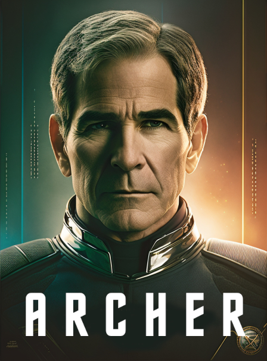

# Fan-Fiction

## inspiered by STAR TREK.

**Description**: The poster features a heroic and stoic Scott Bakula as Captain Jonathan Archer in his 60s, standing tall and gazing into the distance. He is positioned at the center of the poster, with a sense of authority and wisdom gained through years of experience as a Starfleet captain. 

**Composition**: Captain Archer is wearing a sleek, updated version of the classic Starfleet uniform, with a mix of the classic Enterprise-era design and modern accents from Star Trek: Picard. The uniform consists of a navy-blue jumpsuit with gold shoulder trim and a gold Starfleet emblem on the chest. The background is a mix of celestial elements and the iconic Star Trek starship. The U.S.S. Enterprise NX-01 is positioned behind and slightly to the right of Captain Archer, soaring through a vast expanse of space filled with stars, nebulas, and distant galaxies. To the left of Captain Archer, a transparent, holographic-like image of the Starfleet insignia hovers, symbolizing the strong connection to Starfleet's ideals and values. 

**Typography**: The title "Star Trek: Archer" is displayed in bold, uppercase letters at the top of the poster, using the classic Star Trek font with a modern touch. Scott Bakula's name is displayed above the title, in a slightly smaller font size, and in the same typography style as the title. The color of the text is gold, contrasting against the deep blue and black hues of the background. 

**Technical Details**: The poster size should be 27 inches x 40 inches (68.58 cm x 101.6 cm), a standard movie poster size. The image resolution should be 300 DPI (dots per inch) to ensure a high-quality print. The artwork should be in CMYK color mode to achieve accurate color representation during the printing process. The final file should be delivered in a print-

